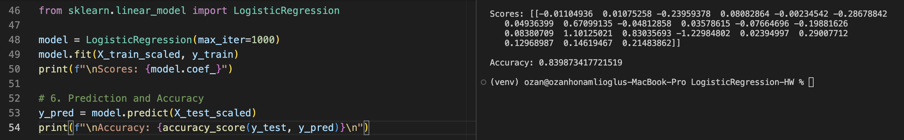
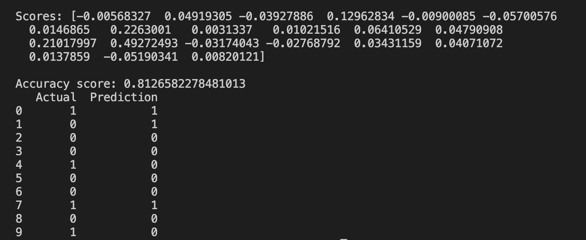

# Logistic Regression
Logistic regression is a type of classification ML algorithm. With the help of logistic regression, we can decide if a picture is a cat or not.

This project aims to implement the algorithm from scratch with only math equations.

# Author Comments
I will leave two pictures for how the model performs compared to production grade library `from sklearn.linear_model import LogisticRegression`

### Results of LogisticRegression from sklearn

Accuracy is around: 0.839

### Results of LogisticRegression from custom implementation

Accuracy is around: 0.812

With the custom implementation it sometimes takes time to adjust parameters for the dataset such as defining a learning rate and epoch. There will be updates to make the learning rate more smarter.